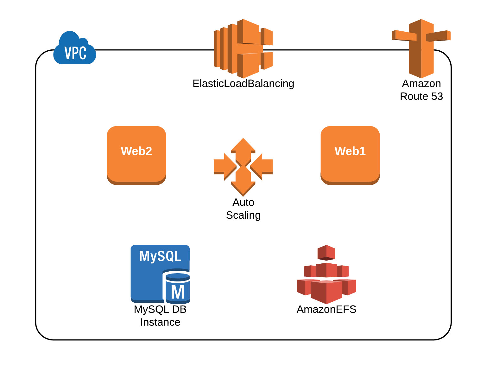

=======
Sceptre Wordpress
=======

Meetup Munich
-----

Sceptre is a tool to drive AWS `CloudFormation <https://aws.amazon.com/cloudformation/>`_. It automates away some of the more mundane, repetitive and error-prone tasks, allowing you to concentrate on building better infrastructure.

Sceptre's source code can be found `here <https://github.com/cloudreach/sceptre>`_.

Features:

- Code reusability by separating a stack's template and its configuration
- Support for templates written in JSON, YAML or Python DSLs such as Troposphere
- Dependency resolution by passing of stack outputs to parameters of dependent stacks
- Environment support by bundling related stacks into logical groups (e.g. dev and prod)
- Environment-level commands, such as creating multiple stacks with a single command
- Fast, highly parallelised builds
- Built in support for working with stacks in multiple AWS accounts
- Infrastructure visibility with meta-operations such as stack querying protection
- Support for inserting dynamic values in templates via customisable resolvers
- Support for running arbitrary code as hooks before/after stack builds

Code
-------

Sceptre organises stacks into environments. Each stack is represented by a YAML configuration file stored in a directory which represents the environment. Here, we have two environments, ``prod`` and ``dev`` ::

  $ tree
  .
  ├── LICENSE
  ├── NOTICE
  ├── README.rst
  ├── config
  │   ├── config.yaml
  │   ├── dev
  │   │   ├── config.yaml
  │   │   ├── efs.yaml
  │   │   ├── rds.yaml
  │   │   ├── role.yaml
  │   │   ├── security-groups.yaml
  │   │   ├── vpc.yaml
  │   │   └── wordpress.yaml
  │   └── prod
  │       ├── config.yaml
  │       ├── efs.yaml
  │       ├── rds.yaml
  │       ├── security-groups.yaml
  │       ├── vpc.yaml
  │       └── wordpress.yaml
  └── src
      ├── base.py
      ├── constants.py
      ├── efs.py
      ├── rds.py
      ├── role.py
      ├── security_groups.py
      ├── vpc.py
      └── wordpress.py

Diagram
-------

Install
-------

::

  $ pip install sceptre

More information on installing sceptre can be found in our `Installation Guide <http://sceptre.cloudreach.com/docs/installation.html>`_.

How to start
-----

Sceptre can be used from the CLI, or imported as a Python package.::

  $ git clone git@github.com:cloudreach/sceptre-wordpress-example.git
  $ cd sceptre-wordpress-example

Be sure your `AWS credential <http://docs.aws.amazon.com/cli/latest/userguide/cli-chap-getting-started.html#cli-quick-configuration>`__ are properly configured

How to deploy ``dev`` and ``prod`` ::

  $ sceptre launch-env dev
  $ sceptre launch-env prod

How to apply a change-set on ``dev`` for ``wordpress`` stack ::

  $ sceptre update-stack-cs dev wordpress

Tutorial and Documentation
--------------------------

- `Get Started <http://sceptre.cloudreach.com/docs/get_started.html>`_
- `Documentation <http://sceptre.cloudreach.com/docs/>`__

License
-------------

**sceptre** is licensed under the `Apache Software License 2.0 <LICENSE>`_.

Thanks
-------------

`Intelligent Cloud Adoption. <https://www.cloudreach.com/>`_
